# Operationalizing Machine Learning

## Overview
In this project which is a part of the Azure ML Engineer Nanodegree, we continued to work with the Bank Marketing dataset.
We used Azure to configure a cloud-based machine learning production model, deploy it, and consume it. We also learned 
to create, publish, and consume a pipeline.

## Architectural Diagram
*Figure 1: Architectural Diagram*

## Key Steps
**1. Authentication :** 

In this step we were supposed to create a Security Principal (SP) to interact with the Azure Workspace.
I skipped this step as I am not using my own Azure account but instead using the lab Udacity account. You can see the 
authentication failure printed in the console below as depicted in *Figure 2*.

*Figure 2: Authentication Failure*
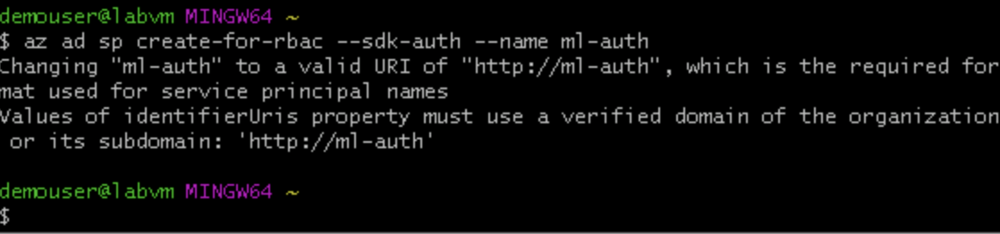

**2. Automated ML Experiment :** 

I configured a compute cluster (Standard_DS3_v2), registered the bank marketing dataset
and set up and ran an Automated ML experiment (best-model). This experiment identified VotingEnsemble to be the best 
model with a weighted AUC of 0.95. 

*Figure 3: Registered Dataset*
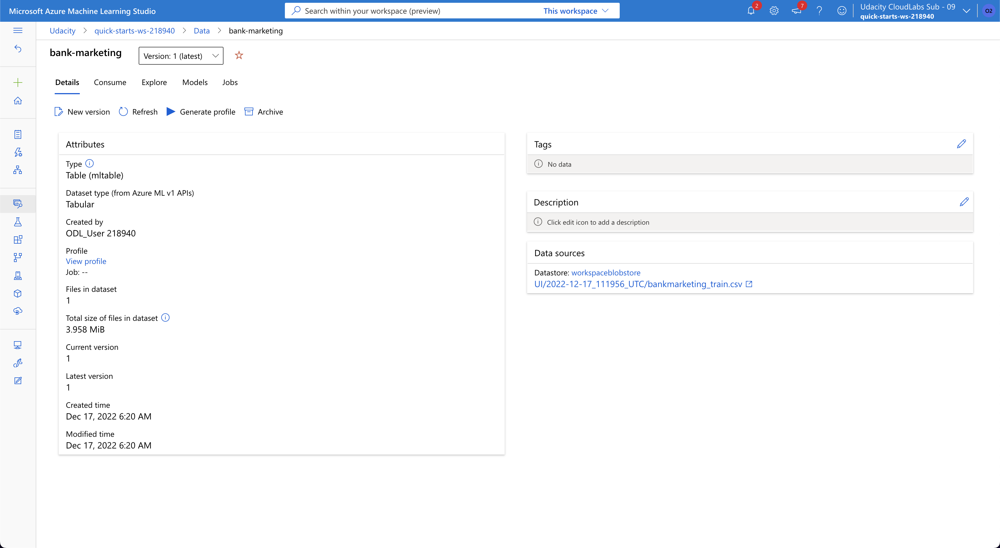

*Figure 4: Experiment Completion*
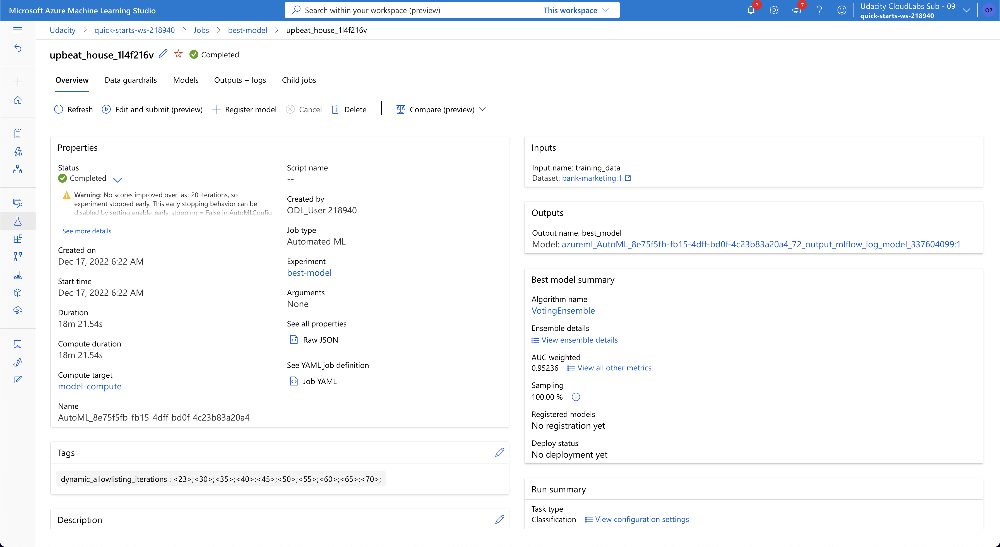

*Figure 5: AutoML Models*
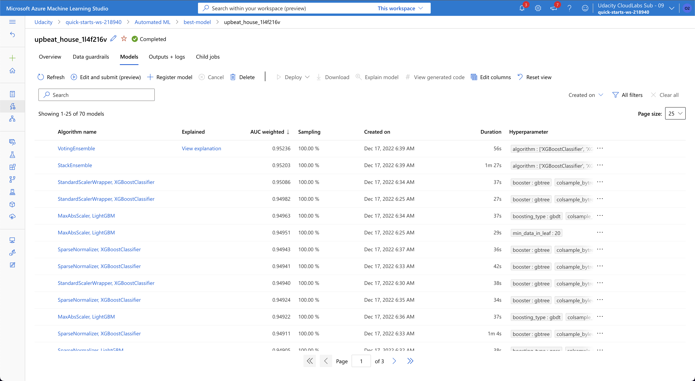

*Figure 6: Best AutoML Model Metrics*
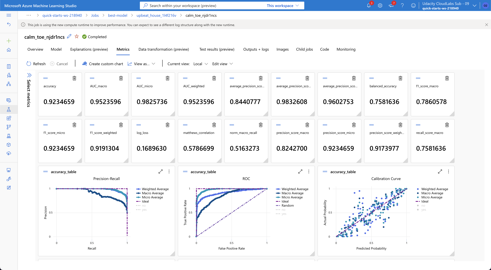

**3. Deploy the best model :** 

I deployed the best model using Azure Container Instance (ACI) with authentication enabled. 

*Figure 7: Model Deployment*
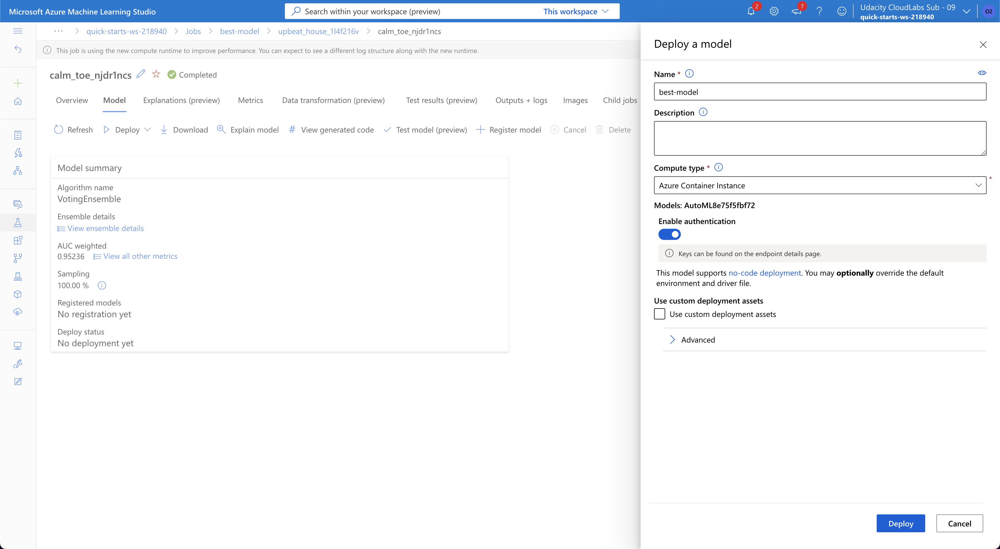

**4. Enable logging :**

I created a virtual conda environment and installed the Python SDK for Azure.
I edited and ran the provided *logs.py* to enable logging. This helped monitor the deployed model and keep track of the
request frequency, latency, etc.

*Figure 8: Application Insights Enabled*
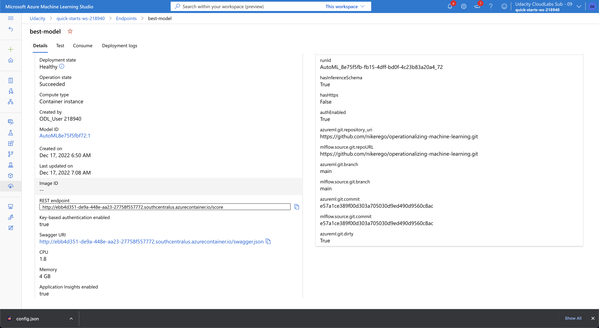

*Figure 9: Running Logs*
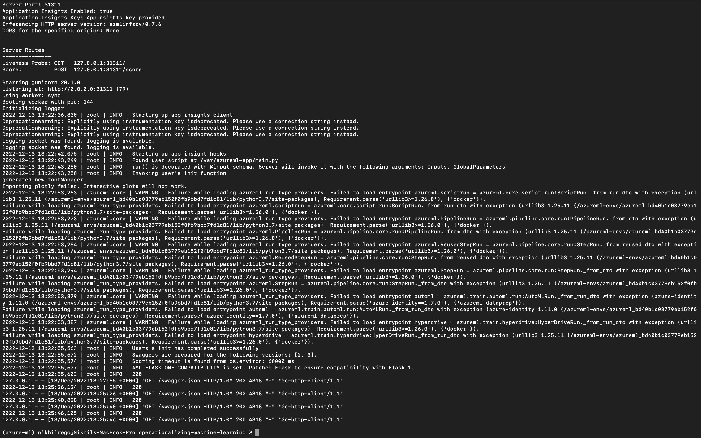

**5. Swagger Documentation :**

I downloaded *swagger.json* and ran both *swagger.sh* and *serve.py*. I interacted
with the swagger instance running with the documentation for the HTTP API for the model.

*Figure 10: Serving Swagger Directory*
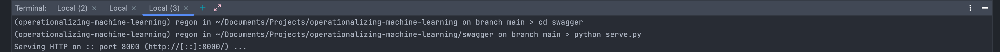

*Figure 11: Swagger UI Container*
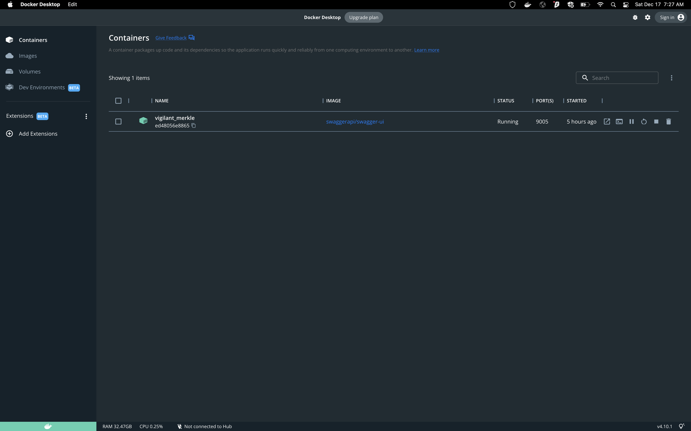

*Figure 12: Swagger API*
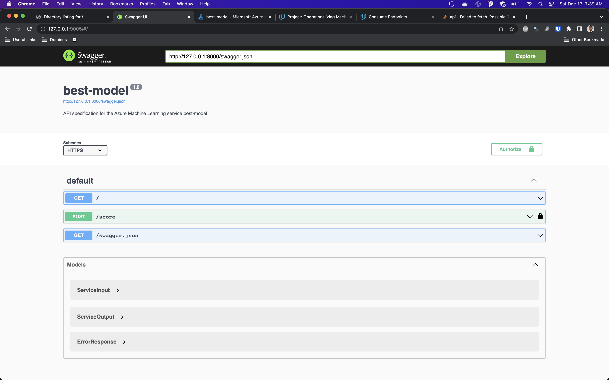

**6. Consume model endpoints :**

I successfully demonstrated the model was consumable by modifying and running *endpoint.py*. I also demonstrated I 
could consume the model using Postman.

*Figure 13: Consume Model*
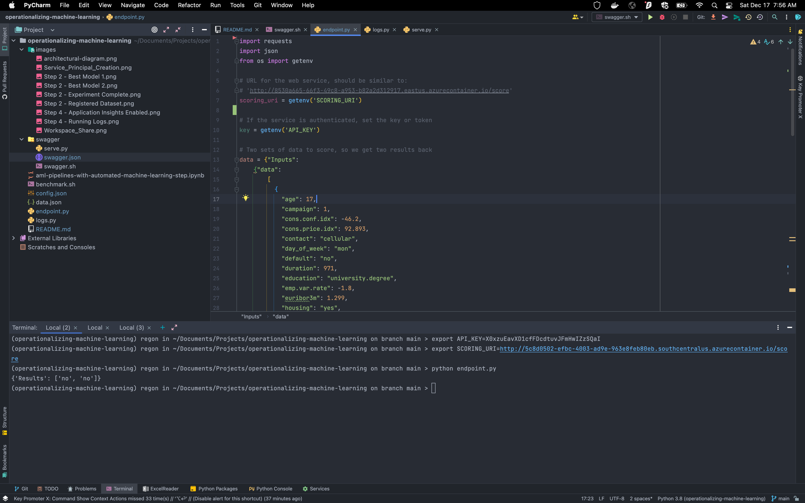

*Figure 14: Consume Model Via Postman*
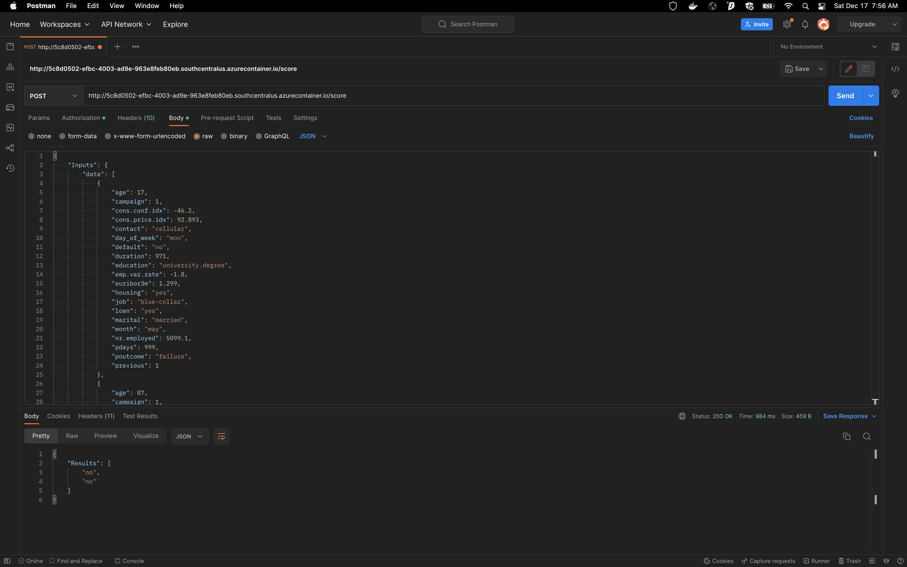

**7. Create and publish a pipeline :** 

I uploaded and updated the jupyter notebook provided to match the environment. I 
demonstrated it was running successfully.

*Figure 15: Pipeline Running*
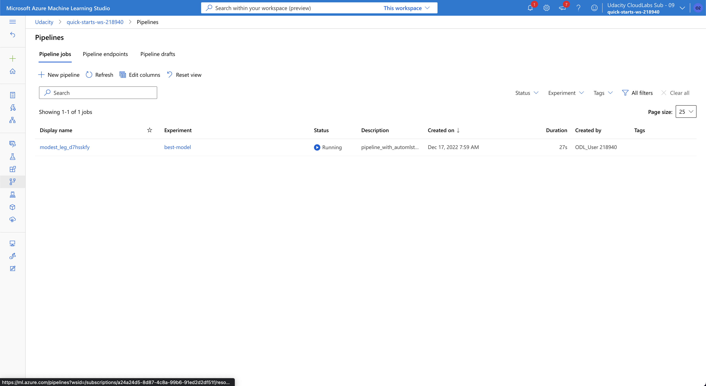

*Figure 16: Pipeline Completion Notebook*
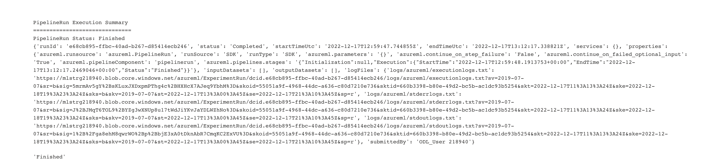

*Figure 16: Pipeline Completion*
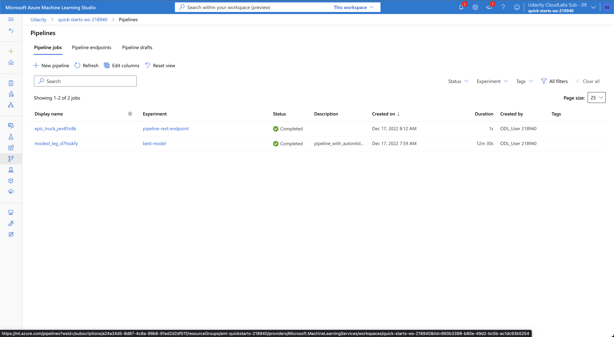

*Figure 16: Published Pipeline*
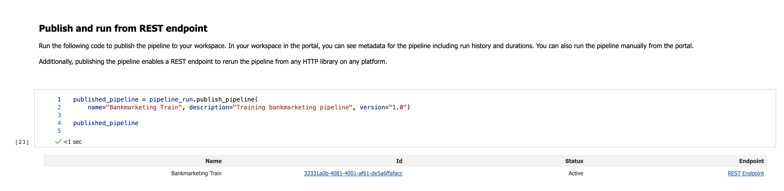

*Figure 16: Published Pipeline Endpoint*
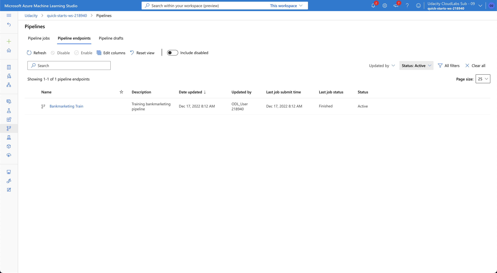

**8. Documentation:** 

I documented my steps and results in this readme with supporting figures.

## Screen Recording
[https://youtu.be/97uhnickb0M](https://youtu.be/97uhnickb0M)

## Standout Suggestions
I used environment variables to pass sensitive arguments to my scripts. This is generally considered good practice to 
secure passwords, keys, ...etc. A few other things I noticed I could change were to use cross validation to avoid overfitting 
of my model as well as enable deep learning as a part of the AutoML training process. I used a validation test set size of 
10% of the data to achieve a weighted AUC of 95%.